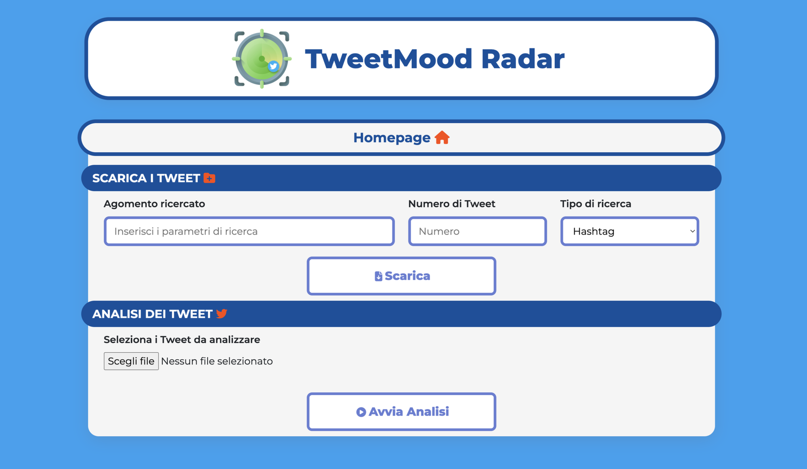
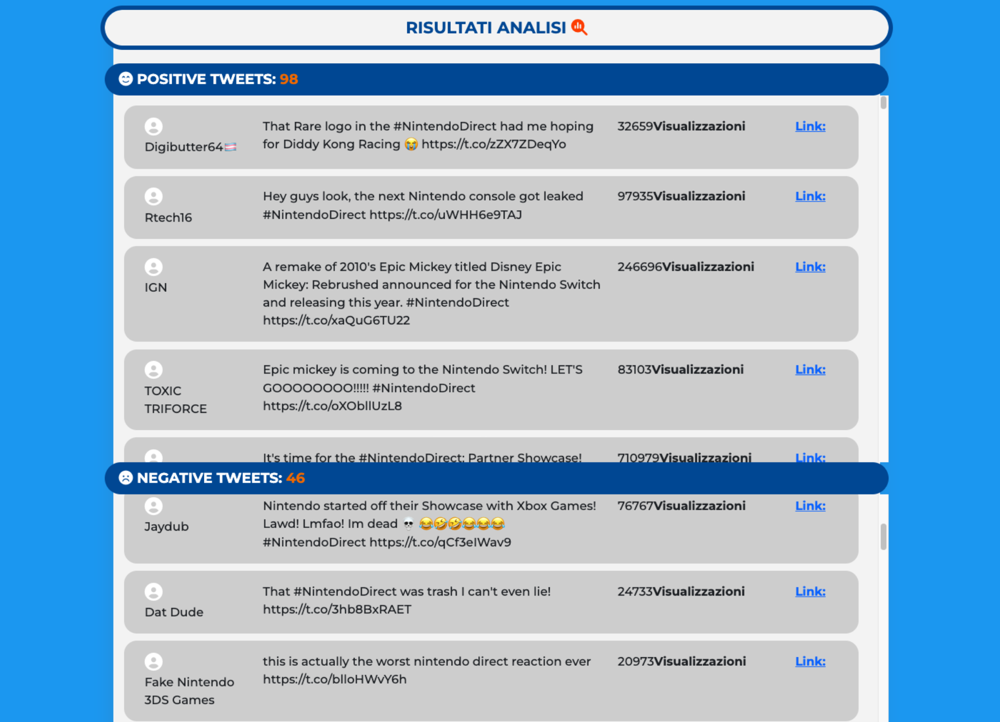

# Tweet MoodRadar
## L'obiettivo 🎯
Il progetto **TweetMood** Radar nasce con l’obiettivo di **effettuare un analisi delle opinioni e dei pensieri che gli utenti di Twitter (X) esprimono riguardo un determinato argomento**, evento o notizia, studiando in particolare **quali sentimenti/emozioni le persone vogliono esprimere** riguardo il tema in questione.

## Come funziona ⚙️
Quest’analisi verrà fatta leggendo in tempo reale i tweet più rilevanti che gli utenti hanno pubblicato in merito ad un determinato argomento, identificato dall’apposito hashtag (#), ed in particolare saranno letti i tweet della sezione "Popolari" che la pagina internet del social network di Elon Musk mostra quando si seleziona un determinato topic. 

Questi dati raccolti, saranno sottoposti al **modello di Sentiment Analysis** che riuscirà, come già detto, ad estrapolare e restituire **quali solo le emozioni ed i sentimenti potenzialmente espressi nel testo.**

Le informazioni poi saranno analizzate in maniera aggregata, mostrando quali sono i sentimenti predominanti degli utenti riguardo il tema in analisi.

# Implementazione 💻
## Il Dataset 📊
Per il training del modello di machine learning alla base di questo progetto, è stato utilizzato il seguente dataset, contenente circa 1 600 000 tweet già classificati come "negative" oppure "positive".

1. (Dataset) Sentiment140 [(link)](https://www.kaggle.com/datasets/kazanova/sentiment140/)

## Tech Stack 💾

**Front-end:** HTML, CSS, JavaScript

**Back-end:** Electron.js, Python

# Documentazione 📄

È possibile consultare la documentazione del progetto, contenente **informazioni dettagliate riguardo:**

- dataset utilizzato
- data preparation
- **addestramento e valutazione del modello**

[Clicca qui per la documentazione](https://drive.google.com/file/d/1VhscnNcHCx4mZLH4E6LTWa0KYU74_7gz/view?usp=sharing)

## Screenshots 📷
**Homepage**

**Risultati Analisi**

